# 狮子 跳动

A new Flutter project.
- SafeArea_learn.dart
    - 通过足够的填充插入其子项以避免操作系统入侵的小部件。 
      例如，这将使子项缩进足够多以避免屏幕顶部的状态栏。
      它还会将孩子缩进必要的数量，以避免 iPhone X 上的缺口，
      或显示器的其他类似创意物理特征。 当最小指定填补处理，
      最小填充或安全区域填充中的较大者将被应用
- Expanded
    - 扩展Row、Column或Flex 的子级以便子级填充可用空间的小部件。
      使用Expanded小部件可以使Row、Column或Flex 的子项 扩展以填充沿主轴的可用空间（例如，水平用于Row或垂直用于Column）。如果扩展了多个子项，则根据弹性系数在它们之间分配可用空间。
      一个扩展插件必须是一个的后代行，列，或柔性，和路径从扩展插件到其封闭行，列，或 柔性必须只包含StatelessWidget S或StatefulWidget秒（而不是其他类型的小部件，像RenderObjectWidget小号）。
    - 
- Wrap
    - 在多个水平或垂直运行中显示其子项的小部件。
      甲裹勾画出每个子并尝试放置由下式给出相邻于主轴线的前一个子子，方向，留下间隔 之间的空间。如果没有足够的空间容纳子项，Wrap 会在横轴中与现有子项相邻的位置创建一个新运行。
      将所有子项分配给运行后，运行中的子项将根据主轴中的对齐方式和交叉轴中的crossAxisAlignment进行定位。
      然后根据runSpacing和runAlignment将运行本身定位在交叉轴上 。
    - 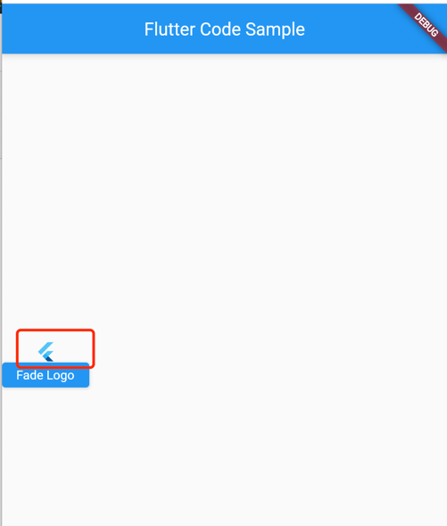 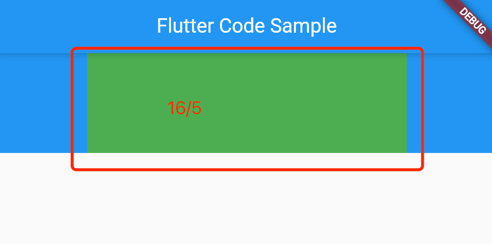  
- PageView
    - 逐页工作的可滚动列表。
      页面视图的每个子项都被强制与视口的大小相同。
      您可以使用PageController来控制哪个页面在视图中可见。除了能够控制PageView内部内容的像素偏移之外，PageController还允许您根据页面来控制偏移，这是视口大小的增量。
      所述的PageController也可以用来控制 PageController.initialPage，其确定当被显示的页面 浏览量首先构造，并且PageController.viewportFraction，这就决定了页作为视口尺寸的一小部分的大小。
      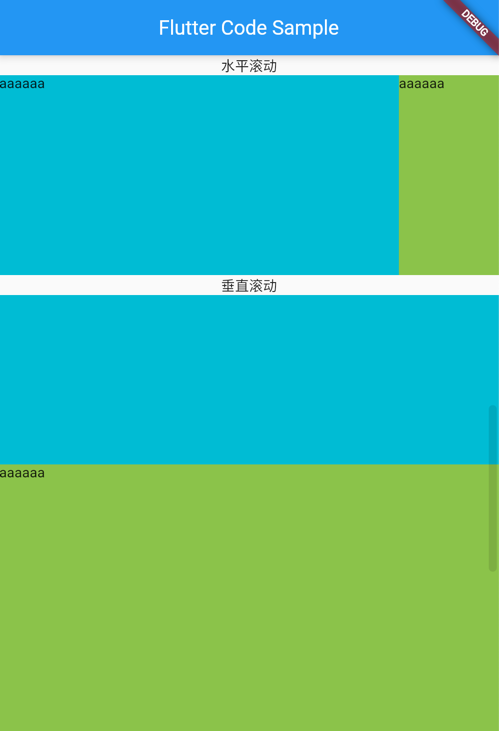 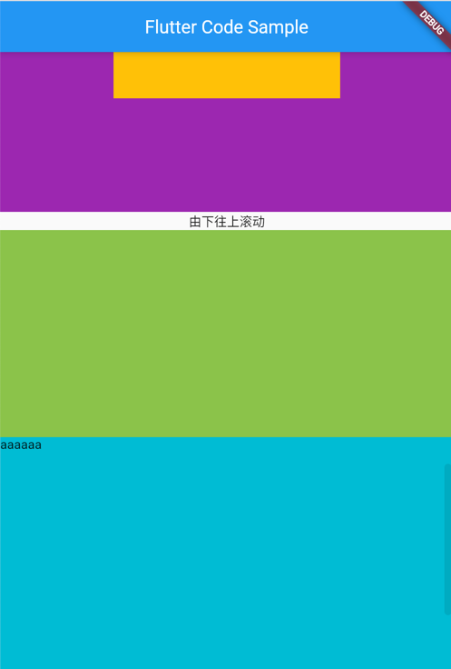
- Table
    - 为其子项使用表格布局算法的小部件。
    -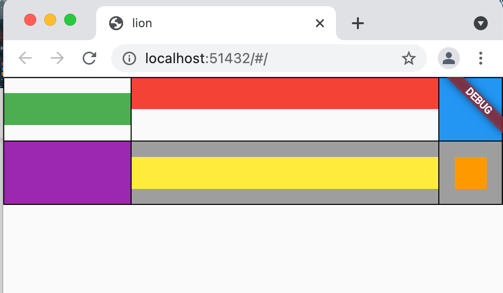
      
-  SliverAppBar
    - Sliver 应用栏通常用作CustomScrollView的第一个子项 ，它让应用栏与滚动视图集成，以便它可以根据滚动偏移量改变高度或浮动在滚动视图中的其他内容之上。对于屏幕顶部的固定高度应用栏，请参阅AppBar，它用于Scaffold.appBar插槽中。 所述AppBar显示工具栏窗口小部件，龙头，标题，和 动作，上述底部（如果有的话）。如果指定了flexibleSpace小部件，则它会堆叠在工具栏和底部小部件的后面。
    - 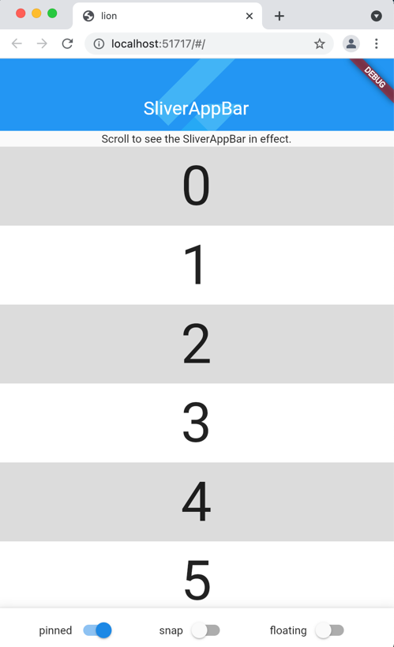

- floatingActionButton
    - 个材料设计的浮动动作按钮。
      浮动操作按钮是一个圆形图标按钮，它悬停在内容上以提升应用程序中的主要操作。浮动操作按钮最常用于Scaffold.floatingActionButton字段。
      每个屏幕最多使用一个浮动操作按钮。浮动操作按钮应用于积极的操作，例如“创建”、“共享”或“导航”。（如果在一个Route 中使用了多个浮动操作按钮 ，那么请确保每个按钮都有一个唯一的heroTag，否则将抛出异常。）
      如果onPressed回调为空，则按钮将被禁用并且不会对触摸做出反应。强烈建议不要禁用浮动操作按钮，因为不会向用户指示该按钮已禁用。如果禁用浮动操作按钮，请考虑更改backgroundColor。
    -   
- Opacity
    - 使其子项部分透明的小部件。
      此类将其子级绘制到中间缓冲区中，然后将子级混合回部分透明的场景。
      对于 0.0 和 1.0 以外的不透明度值，此类相对昂贵，因为它需要将子级绘制到中间缓冲区中。对于值 0.0，孩子根本没有被绘制。对于值 1.0，子项会立即绘制，无需中间缓冲区。
    -   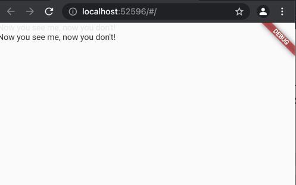
- AnimatedContainer
    - 在一段时间内逐渐改变其值的容器的动画版本。 该AnimatedContainer当他们改变使用所提供的曲线和持续时间会自动属性的新旧值之间的动画。为 null 的属性没有动画。它的孩子和后代没有动画。 此类可用于在具有其内部AnimationController 的Container 的不同参数之间生成简单的隐式转换。对于更复杂的动画，您可能希望使用AnimatedWidget的子类， 例如DecoratedBoxTransition或使用您自己的 AnimationController。
    - 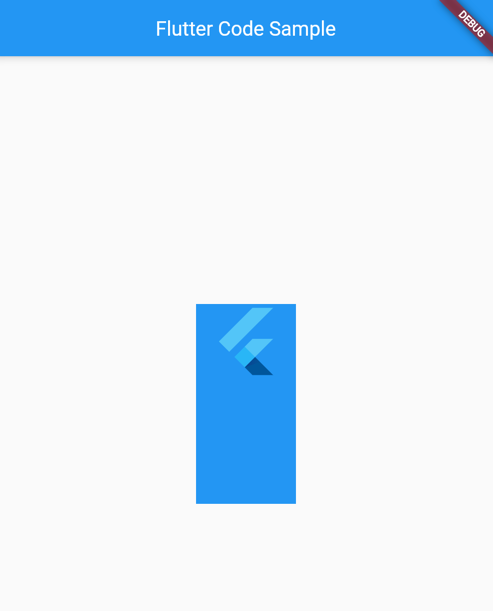
- FadeTransition
    - 动画小部件的不透明度。对于在两个孩子的大小之间自动动画的小部件，在它们之间淡入淡出，请参阅AnimatedCrossFade。
    - 
    

- SliverList
    - 将多个具有相同主轴范围的框子元素放置在线性阵列中的条子。
  SliverFixedExtentList将其子项放置在沿主轴的线性数组中，从偏移量 0 开始且没有间隙。每个孩子都被迫在主轴上有itemExtent，在横轴上有 SliverConstraints.crossAxisExtent。
  SliverFixedExtentList比SliverList更有效，因为 SliverFixedExtentList不需要对其子项执行布局来获取它们在主轴上的范围
      
    - 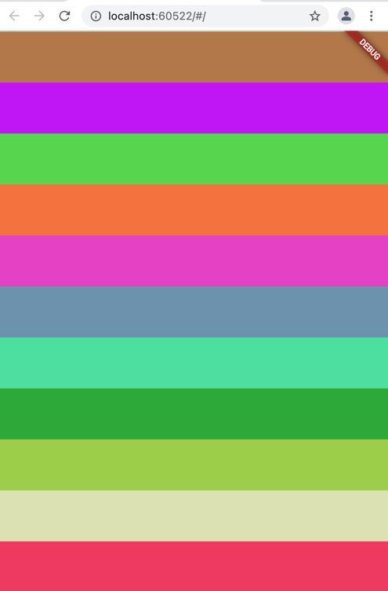
- SliverGrid
    - 将多个盒子孩子放置在二维排列中的条子。
      SliverGrid将其子项放置在gridDelegate确定的任意位置 。每个孩子都被迫具有gridDelegate指定的大小 。
      网格的主轴方向就是它滚动的方向；横轴方向为正交方向。
    - 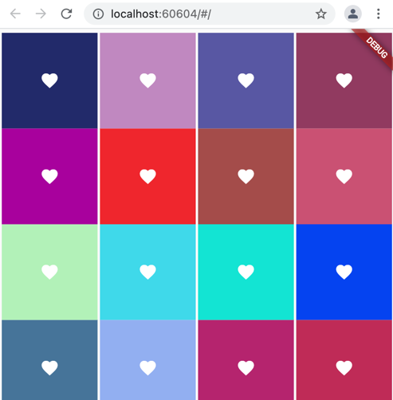
-  FadeInImage
    -   在加载目标图像时显示占位符图像的图像，然后在加载时淡入新图像。 使用此类来显示长时间加载的图像，例如new NetworkImage，以便图像以优美的动画出现在屏幕上，而不是突然出现在屏幕上。
    - 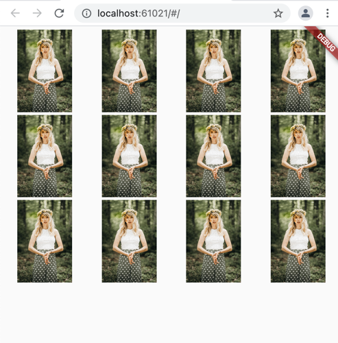
-  ClipRRect
    - 使用圆角矩形剪辑其子项的小部件。 默认情况下，ClipRRect使用自己的边界作为剪辑的基本矩形，但可以使用自定义剪辑器自定义剪辑的大小和位置 。
    - 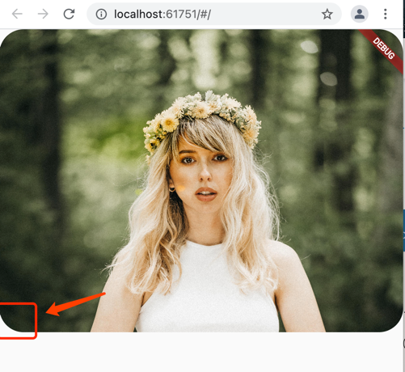
- Hero
    - 此示例显示了在ListTile 中使用的Hero。 当一个新的MaterialPageRoute被推送时，点击 Hero 包裹的矩形会触发一个英雄动画。矩形的大小和位置都具有动画效果。 两个小部件使用相同的Hero.tag。 Hero 小部件使用匹配的标签来识别和执行此动画。
    - 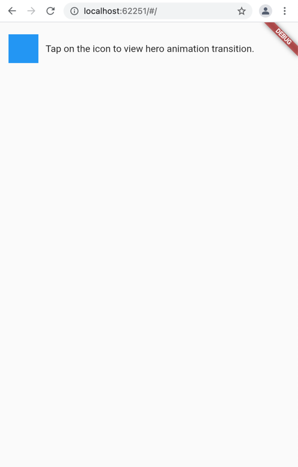 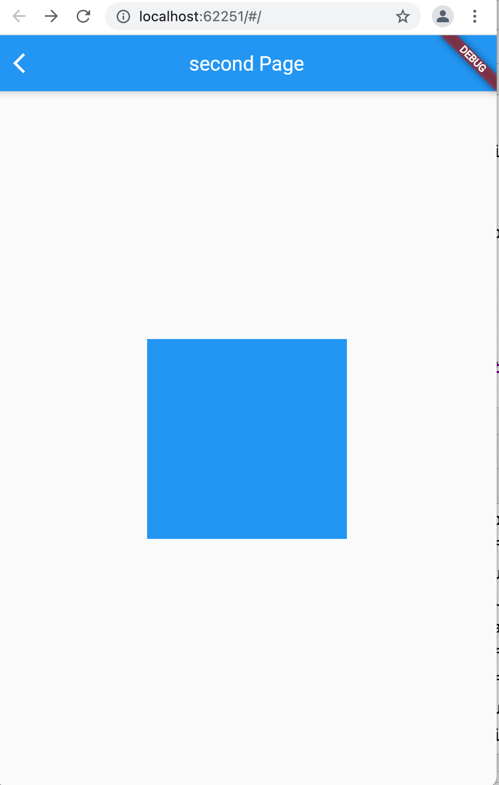
- CustomPainter
    - CustomPaint可以称之为动画鼻祖，它可以实现任何酷炫的动画和效果。CustomPaint本身没有动画属性，仅仅是绘制属性，一般情况下，CustomPaint会和动画控制配合使用，达到理想的效果。
    - 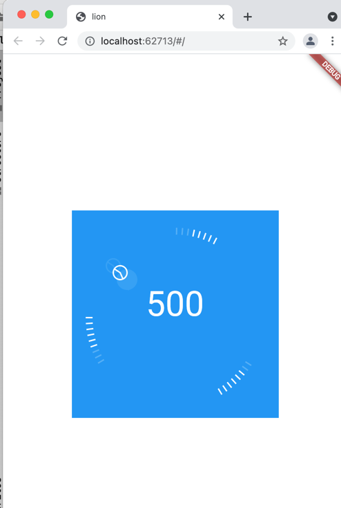
    
- Tooltip
    - 工具提示提供文本标签，有助于解释按钮或其他用户界面操作的功能。将按钮包裹在Tooltip小部件中，并提供一条消息，该消息将在长按小部件时显示。
      许多小部件（例如IconButton、FloatingActionButton和 PopupMenuButton ）都有一个tooltip属性，当该属性为非空时，会导致小部件在其构建中包含工具提示。
      工具提示通过证明小部件的文本表示来提高可视小部件的可访问性，例如，可以由屏幕阅读器发出声音。
    -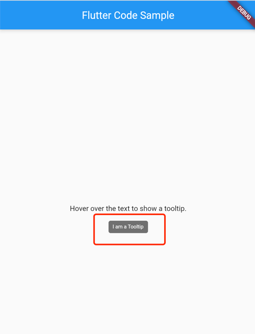
      
- FittedBox
    - 根据fit缩放和定位它的孩子。
    -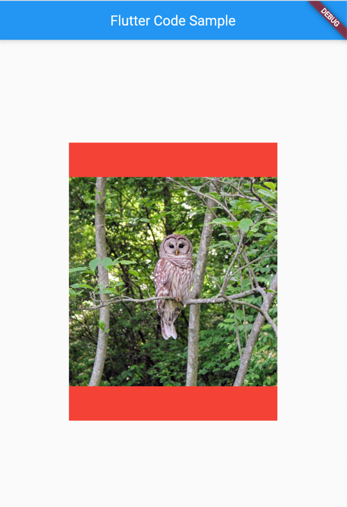

## Getting Started

This project is a starting point for a Flutter application.

A few resources to get you started if this is your first Flutter project:

- [Lab: Write your first Flutter app](https://flutter.dev/docs/get-started/codelab)
- [Cookbook: Useful Flutter samples](https://flutter.dev/docs/cookbook)

For help getting started with Flutter, view our
[online documentation](https://flutter.dev/docs), which offers tutorials,
samples, guidance on mobile development, and a full API reference.
