# 狮子 跳动

A new Flutter project.

- SafeArea_learn.dart
    - 通过足够的填充插入其子项以避免操作系统入侵的小部件。 例如，这将使子项缩进足够多以避免屏幕顶部的状态栏。 它还会将孩子缩进必要的数量，以避免 iPhone X 上的缺口， 或显示器的其他类似创意物理特征。 当最小指定填补处理，
      最小填充或安全区域填充中的较大者将被应用
- Expanded
    - 扩展Row、Column或Flex 的子级以便子级填充可用空间的小部件。 使用Expanded小部件可以使Row、Column或Flex 的子项
      扩展以填充沿主轴的可用空间（例如，水平用于Row或垂直用于Column）。如果扩展了多个子项，则根据弹性系数在它们之间分配可用空间。 一个扩展插件必须是一个的后代行，列，或柔性，和路径从扩展插件到其封闭行，列，或
      柔性必须只包含StatelessWidget S或StatefulWidget秒（而不是其他类型的小部件，像RenderObjectWidget小号）。
    - 
- Wrap
    - 在多个水平或垂直运行中显示其子项的小部件。 甲裹勾画出每个子并尝试放置由下式给出相邻于主轴线的前一个子子，方向，留下间隔 之间的空间。如果没有足够的空间容纳子项，Wrap 会在横轴中与现有子项相邻的位置创建一个新运行。
      将所有子项分配给运行后，运行中的子项将根据主轴中的对齐方式和交叉轴中的crossAxisAlignment进行定位。 然后根据runSpacing和runAlignment将运行本身定位在交叉轴上 。
    -  
- PageView
    - 逐页工作的可滚动列表。 页面视图的每个子项都被强制与视口的大小相同。
      您可以使用PageController来控制哪个页面在视图中可见。除了能够控制PageView内部内容的像素偏移之外，PageController还允许您根据页面来控制偏移，这是视口大小的增量。
      所述的PageController也可以用来控制 PageController.initialPage，其确定当被显示的页面
      浏览量首先构造，并且PageController.viewportFraction，这就决定了页作为视口尺寸的一小部分的大小。
       
- Table
    - 为其子项使用表格布局算法的小部件。
      -

- SliverAppBar
    - Sliver 应用栏通常用作CustomScrollView的第一个子项
      ，它让应用栏与滚动视图集成，以便它可以根据滚动偏移量改变高度或浮动在滚动视图中的其他内容之上。对于屏幕顶部的固定高度应用栏，请参阅AppBar，它用于Scaffold.appBar插槽中。
      所述AppBar显示工具栏窗口小部件，龙头，标题，和 动作，上述底部（如果有的话）。如果指定了flexibleSpace小部件，则它会堆叠在工具栏和底部小部件的后面。
    - 

- floatingActionButton
    - 个材料设计的浮动动作按钮。 浮动操作按钮是一个圆形图标按钮，它悬停在内容上以提升应用程序中的主要操作。浮动操作按钮最常用于Scaffold.floatingActionButton字段。
      每个屏幕最多使用一个浮动操作按钮。浮动操作按钮应用于积极的操作，例如“创建”、“共享”或“导航”。（如果在一个Route 中使用了多个浮动操作按钮 ，那么请确保每个按钮都有一个唯一的heroTag，否则将抛出异常。）
      如果onPressed回调为空，则按钮将被禁用并且不会对触摸做出反应。强烈建议不要禁用浮动操作按钮，因为不会向用户指示该按钮已禁用。如果禁用浮动操作按钮，请考虑更改backgroundColor。
    - 
- Opacity
    - 使其子项部分透明的小部件。 此类将其子级绘制到中间缓冲区中，然后将子级混合回部分透明的场景。 对于 0.0 和 1.0 以外的不透明度值，此类相对昂贵，因为它需要将子级绘制到中间缓冲区中。对于值
      0.0，孩子根本没有被绘制。对于值 1.0，子项会立即绘制，无需中间缓冲区。
    - 
- AnimatedContainer
    - 在一段时间内逐渐改变其值的容器的动画版本。 该AnimatedContainer当他们改变使用所提供的曲线和持续时间会自动属性的新旧值之间的动画。为 null 的属性没有动画。它的孩子和后代没有动画。
      此类可用于在具有其内部AnimationController 的Container 的不同参数之间生成简单的隐式转换。对于更复杂的动画，您可能希望使用AnimatedWidget的子类，
      例如DecoratedBoxTransition或使用您自己的 AnimationController。
    - 
- FadeTransition
    - 动画小部件的不透明度。对于在两个孩子的大小之间自动动画的小部件，在它们之间淡入淡出，请参阅AnimatedCrossFade。
    - 

- SliverList
    - 将多个具有相同主轴范围的框子元素放置在线性阵列中的条子。 SliverFixedExtentList将其子项放置在沿主轴的线性数组中，从偏移量 0 开始且没有间隙。每个孩子都被迫在主轴上有itemExtent，在横轴上有
      SliverConstraints.crossAxisExtent。 SliverFixedExtentList比SliverList更有效，因为
      SliverFixedExtentList不需要对其子项执行布局来获取它们在主轴上的范围

    - 
- SliverGrid
    - 将多个盒子孩子放置在二维排列中的条子。 SliverGrid将其子项放置在gridDelegate确定的任意位置 。每个孩子都被迫具有gridDelegate指定的大小 。 网格的主轴方向就是它滚动的方向；横轴方向为正交方向。
    - 
- FadeInImage
    - 在加载目标图像时显示占位符图像的图像，然后在加载时淡入新图像。 使用此类来显示长时间加载的图像，例如new NetworkImage，以便图像以优美的动画出现在屏幕上，而不是突然出现在屏幕上。
    - 
- ClipRRect
    - 使用圆角矩形剪辑其子项的小部件。 默认情况下，ClipRRect使用自己的边界作为剪辑的基本矩形，但可以使用自定义剪辑器自定义剪辑的大小和位置 。
    - 
- Hero
    - 此示例显示了在ListTile 中使用的Hero。 当一个新的MaterialPageRoute被推送时，点击 Hero 包裹的矩形会触发一个英雄动画。矩形的大小和位置都具有动画效果。 两个小部件使用相同的Hero.tag。
      Hero 小部件使用匹配的标签来识别和执行此动画。
    -  
- CustomPainter
    - CustomPaint可以称之为动画鼻祖，它可以实现任何酷炫的动画和效果。CustomPaint本身没有动画属性，仅仅是绘制属性，一般情况下，CustomPaint会和动画控制配合使用，达到理想的效果。
    - 

- Tooltip
    - 工具提示提供文本标签，有助于解释按钮或其他用户界面操作的功能。将按钮包裹在Tooltip小部件中，并提供一条消息，该消息将在长按小部件时显示。 许多小部件（例如IconButton、FloatingActionButton和
      PopupMenuButton ）都有一个tooltip属性，当该属性为非空时，会导致小部件在其构建中包含工具提示。 工具提示通过证明小部件的文本表示来提高可视小部件的可访问性，例如，可以由屏幕阅读器发出声音。

    - 

- FittedBox
    - 根据fit缩放和定位它的孩子。
    - 
- LayoutBuilder
    - 构建一个可以依赖于父小部件大小的小部件树。 类似于Builder小部件，除了框架
      在布局时调用builder函数并提供父小部件的约束。当父级限制子级的大小并且不依赖于子级的内在大小时，这很有用。该LayoutBuilder的最终规模将匹配其孩子的大小。 该生成器函数被调用在以下几种情况：
        - 第一次布置小部件。
        - 当父小部件传递不同的布局约束时。
        - 当父小部件更新此小部件时。
        - 当构建器函数订阅的依赖项发生变化时。
        - 该生成器功能没有如果父母多次通过相同的约束布局过程中调用。
    -  
- AbsorbPointer
    - 此小部件通过终止自身的命中来防止其子树接收事件。它在布局过程中仍然消耗空间并像往常一样绘制它的子元素。它只是防止它的孩子成为定位事件的目标，因为它从RenderBox.hitTest返回 true 。
    - 
- Transform
    - Transform其子Widget绘制时外面包着矩阵变换（transformation），通过它可以实现各种矩阵操作。
    - 
- BackdropFilter
    - 将过滤器应用于现有绘制内容然后绘制child 的小部件。 过滤器将应用于其父或祖先小部件剪辑中的所有区域。如果没有剪辑，过滤器将应用于全屏。
    - 

- Align
    - 一个小部件，可将其子项与其自身对齐，并可选择根据子项的大小调整自身大小。 例如，要在右下角对齐一个框，您可以向这个框传递一个比孩子自然尺寸大的约束，
    - 

- Positioned
    - 控制Stack的子项所在位置的小部件。 定位插件必须是一个的后代堆栈，并从所述路径定位插件其包围堆栈只能包含 StatelessWidget S或StatefulWidget秒（而不是其他类型的小部件，像
      RenderObjectWidget多个）。
    - 

- AnimatedBuilder
    - 用于构建动画的通用小部件。 AnimatedBuilder 对于希望包含动画作为更大构建函数的一部分的更复杂的小部件很有用。要使用 AnimatedBuilder，只需构造小部件并将其传递给构建器函数即可。
      对于没有附加状态的简单情况，请考虑使用 AnimatedWidget。
    - 

- Dismissible
    - 可以通过在指定方向拖动来关闭的小部件。 在DismissDirection
      中拖动或抛出这个小部件会导致孩子滑出视图。以下滑动动画，如果resizeDuration为非空，则可取消插件在动画其高度（或宽度，取垂直于驳回方向）为零resizeDuration。
    - 
- Box
    - 具有指定尺寸的盒子。
      如果给定一个孩子，这个小部件会强制它具有特定的宽度和/或高度。如果此小部件的父级不允许，这些值将被忽略。例如，如果父项是屏幕（强制子项与父项的大小相同）或另一个SizedBox（强制其子项具有特定的宽度和/或高度），则会发生这种情况。这可以通过将子SizedBox包装在一个小部件中来解决，该小部件允许它的大小不超过父级的任何大小，例如Center或Align。
      如果宽度或高度为空，则此小部件将尝试调整自身大小以匹配该维度中孩子的大小。如果孩子的尺寸取决于其父母的尺寸，则必须提供高度和宽度。
      如果没有给定一个孩子，SizedBox将尝试在给定父级约束的情况下尽可能接近指定的高度和宽度。如果 高度或宽度为空或未指定，则将其视为零。
      该新SizedBox.expand构造可以用来制造SizedBox该尺寸本身，以适应父。相当于将width和 height设置为double.infinity。
    - 

- ValueListenableBuilder
    - 其内容与ValueListenable保持同步的小部件。 给定ValueListenable<T>和从
      的具体值构建小部件的构建器T，此类将自动将自己注册为ValueListenable的侦听器，并在值更改时使用更新的值调用构建器。如果您将预构建的子树作为子参数传递，则
      ValueListenableBuilder会将其传递回您的构建器函数，以便您可以将其合并到您的构建中。 使用这个预先构建的孩子是完全可选的，但在某些情况下可以显着提高性能，因此是一种很好的做法。
    - 

- Draggable
    - 可以从中拖动到DragTarget 的小部件。 当可拖动小部件识别出拖动手势的开始时，它会显示一个反馈小部件，该小部件在屏幕上跟踪用户的手指。如果用户在DragTarget上抬起手指，则该目标有机会接受可拖动对象携带的数据。
      在多点触控设备上，可以同时发生多次拖动，因为可以同时有多个指针与设备接触。要限制同时拖动的数量，请使用maxSimultaneousDrags属性。默认设置是允许无限数量的同时拖动。 当零拖动正在进行时，此小部件显示子项。如果
      childWhenDragging不为空，则此小部件会在进行一次或多次拖动时显示 childWhenDragging。否则，此小部件始终显示child。
    - 

- AnimatedList
    - 一个滚动容器，在插入或移除项目时为项目设置动画。 此小部件的AnimatedListState可用于动态插入或删除项目。来指代AnimatedListState要么提供 GlobalKey或使用静态的方法，从项目的输入回调。
      这个小部件类似于由ListView.builder创建的小部件。
    - 

- Flexible
    - 控制Row、Column或Flex的子项如何填充可用空间的小部件。 使用Flexible小部件可以让Row、Column或Flex
      的子级灵活地扩展以填充主轴上的可用空间（例如，水平用于Row或垂直用于Column），但是，与Expanded不同的是 ，Flexible不会要求孩子填满可用空间。
      甲弹性插件必须是一个的后代行，列，或柔性，并从所述路径弹性部件到它的封闭行，列，或 柔性必须只包含StatelessWidget
      S或StatefulWidget秒（而不是其他类型的小部件，像RenderObjectWidget小号）
    - 

- MediaQuery
    - 查询解析给定数据。 例如，要了解当前媒体的大小（例如，包含您的应用程序窗口），您可以读取MediaQueryData.size酒店需要从MediaQueryData返回由MediaQuery.of： MediaQuery.of(
      context).size。 使用MediaQuery.of查询当前媒体将导致您的小部件在MediaQueryData更改时自动重建（例如，如果用户旋转他们的设备）。
      如果没有MediaQuery在范围内，则MediaQuery.of方法将抛出异常。或者，可以使用MediaQuery.maybeOf，如果没有MediaQuery在范围内，它返回 null 而不是抛出。
    - 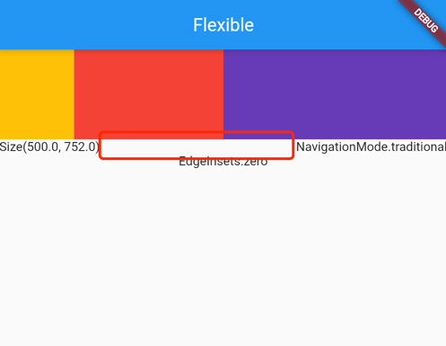

- Spacer
    - Spacer 创建一个可调整的空间隔器，可用于调整Flex容器中小部件之间的间距，例如Row或Column。 该间隔部件将占用任何可用空间，所以设置 Flex.mainAxisAlignment包含在柔性容器间隔以
      MainAxisAlignment.spaceAround，MainAxisAlignment.spaceBetween，或 MainAxisAlignment.spaceEvenly不会有任何明显的效果：
      间隔已采取了一切的额外空间，因此没有剩余空间可以重新分配。
    - 

- InheritedWidget
    - 有效地沿树向下传播信息的小部件的基类。 要从构建上下文获取特定类型的继承小部件的最近实例，请使用BuildContext.dependOnInheritedWidgetOfExactType。
      继承的小部件，当以这种方式引用时，将导致消费者在继承的小部件本身改变状态时重建。

- AnimatedIcon
    - 麻烦，改天研究下

- AspectRatio
    - 子项调整为特定的纵横比。 小部件首先尝试布局约束允许的最大宽度。小部件的高度是通过将给定的纵横比应用于宽度来确定的，表示为宽度与高度的比率。 例如，16:9 宽高比的值为
      16.0/9.0。如果最大宽度为无限大，则通过将纵横比应用于最大高度来确定初始宽度。
    - 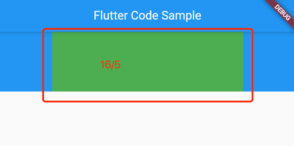

- LimitedBox
    - 仅在不受约束时才限制其大小的框。 如果此小部件的最大宽度不受限制，则其子项的宽度将限制为maxWidth。类似地，如果此小部件的最大高度不受限制，则其子项的高度将限制为maxHeight。
      这具有在无限环境中为孩子提供自然维度的效果。例如，通过为通常尝试尽可能大的小部件提供maxHeight，小部件通常会调整自身大小以适合其父级，但是当放置在垂直列表中时，它将采用给定的高度。
      这在组合通常尝试匹配其父级大小的小部件时很有用，以便它们在列表（无界）中表现合理。
    - 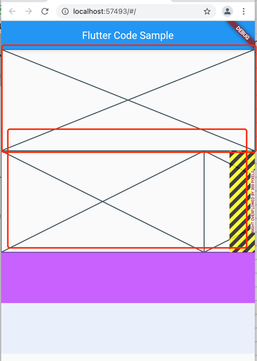

- Placeholder
    - 一个小部件，它绘制一个框，表示有一天其他小部件将被添加到哪里。 这个小部件在开发过程中很有用，可以指示界面尚未完成。
      默认情况下，占位符的大小适合其容器。如果占位符位于无界空间中，它将根据给定的fallbackWidth和fallbackHeight 调整自身大小。
    - 

- RichText
    - 富文本 在富文本使用多个不同风格的小部件显示文本。要显示的文本是使用TextSpan对象树来描述的，每个对象都有一个用于该子树的关联样式。根据布局约束，文本可能会跨多行显示，也可能全部显示在同一行上。
      RichText小部件中显示的文本必须明确设置样式。在选择要使用的样式时，请考虑使用当前 BuildContext 的DefaultTextStyle .
      来提供默认值。有关如何在RichText小部件中设置文本样式的更多详细信息，请参阅TextStyle的文档。 考虑使用Text小部件
      自动与DefaultTextStyle集成。当所有文本使用相同的样式时，默认构造函数就不那么冗长了。该Text.rich构造函数允许使用默认的文本样式，同时还允许每个跨度指定的样式风格多个跨距。 关联
    - 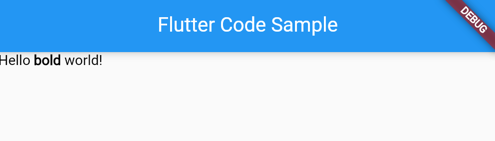

- ReorderableListView
    - 通过拖动以交互方式重新排序其项目的列表。 此类适用于具有少量子级的视图，因为构建List需要为每个可能显示在列表视图中的子级而不是仅那些实际可见的子级进行工作。 所有列表项都必须有一个键。
    - 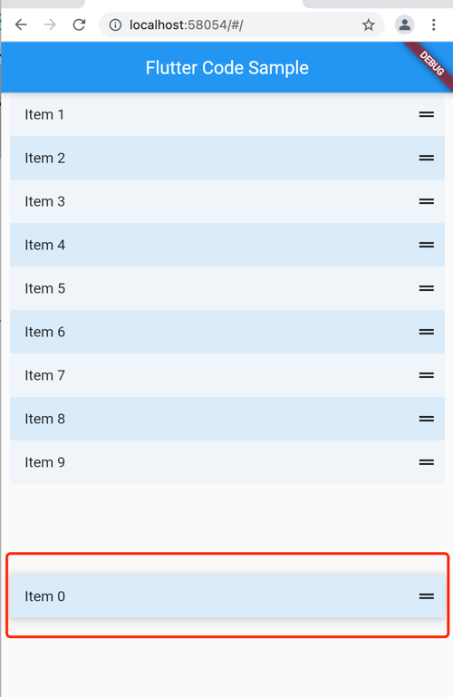

- AnimatedSwitcher
    - 默认情况下在新小部件和之前在AnimatedSwitcher上设置为子部件的小部件之间进行淡入淡出的小部件。如果它们交换得足够快（即在持续时间过去之前），那么在最新的一个正在过渡的同时，可以存在多个先前的孩子并且正在过渡。
      如果“新”的孩子是一样的小部件类型和密钥“老”的孩子，但使用不同的参数，然后AnimatedSwitcher会不会做他们之间的过渡，因为只要框架而言，它们是相同的部件和可以使用新参数更新现有小部件。要强制转换发生，请在您希望被视为唯一的每个子小部件上设置一个键（通常是小部件数据上的一个ValueKey，可将这个子小部件与其他小部件区分开来）。
      新孩子可以使用与已经离家出走的孩子相同的密钥；两者不会被认为是相关的。（例如，如果首先显示带有键 A 的进度指示器，然后是带有键 B 的图像，然后又是带有键 A
      的另一个进度指示器，所有这些都是快速连续的，那么旧的进度指示器和图像将逐渐消失，而新的进度指示器正在消失。） 通过设置 transitionBuilder 可以将过渡类型从交叉淡入淡出更改为自定义过渡。
    - 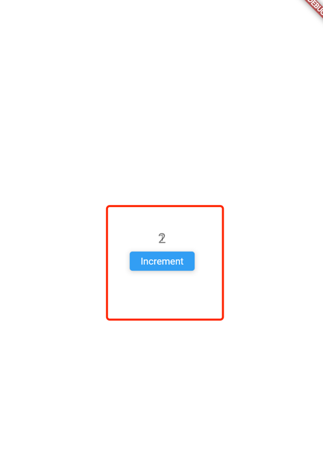 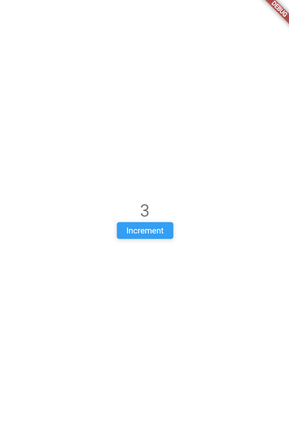

- AnimatedPositioned
    - Positioned 的动画版本，每当给定的位置发生变化时，它会在给定的持续时间内自动转换孩子的位置。仅当它是Stack的孩子时才有效。
      如果孩子的大小最终会因此动画而改变，则此小部件是一个不错的选择。如果大小要保持不变，而只是位置随时间变化，则考虑使用
      SlideTransition。SlideTransition只触发动画的每一帧重绘，而AnimatedPositioned也会触发重新布局。
    - 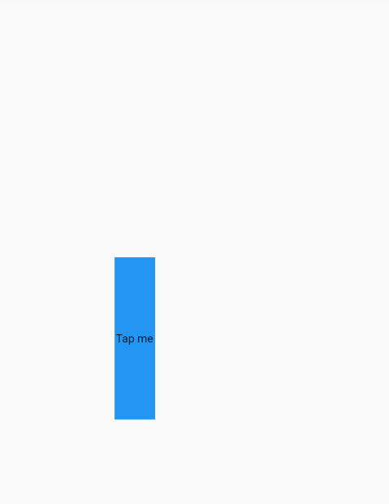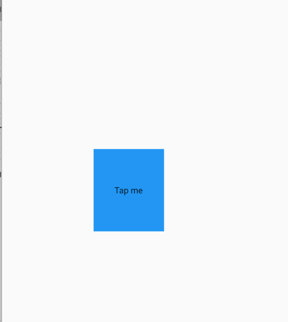

- AnimatedPadding
    - Padding 的动画版本，只要给定的插图发生变化，它就会在给定的持续时间内自动转换缩进。这是使用Curves.fastOutSlowIn曲线 的使用此小部件的示例。
    - 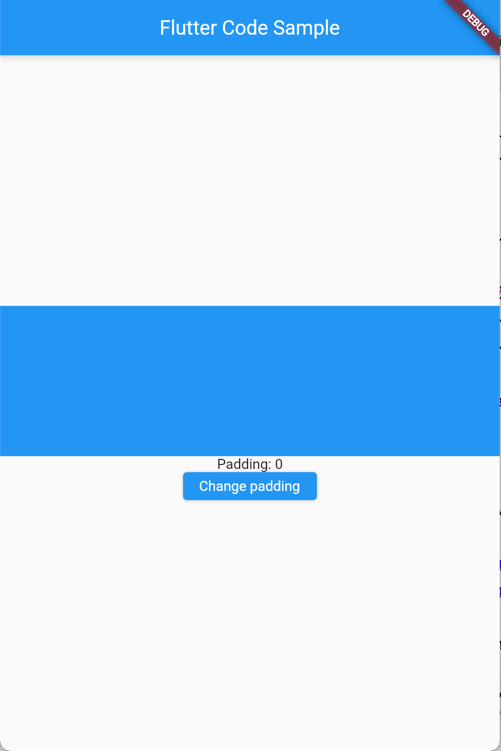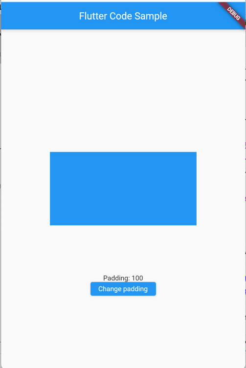

- IndexedStack
    - 一个堆栈昭示着从孩子的名单一个孩子。 显示的子项是具有给定索引的子项。堆栈总是和最大的孩子一样大。 如果值为空，则不显示任何内容。点击来进行切换
    - 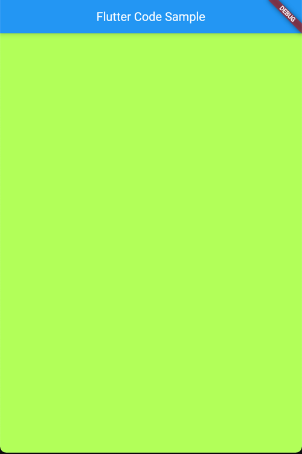 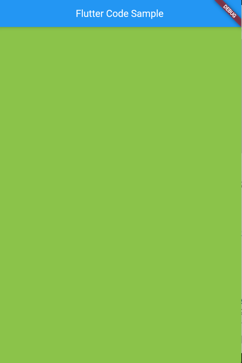

- Semantics
    - 用小部件含义的描述来注释小部件树的小部件。 可访问性工具、搜索引擎和其他语义分析软件使用它来确定应用程序的含义。

- ConstrainedBox
    - 对其子项施加额外约束的小部件。 例如，如果您希望child的最小高度为 50.0 逻辑像素，则可以将其const BoxConstraints(minHeight: 50.0)用作 约束。使用新的
      SizedBox.expand小部件可以获得相同的行为。
    - 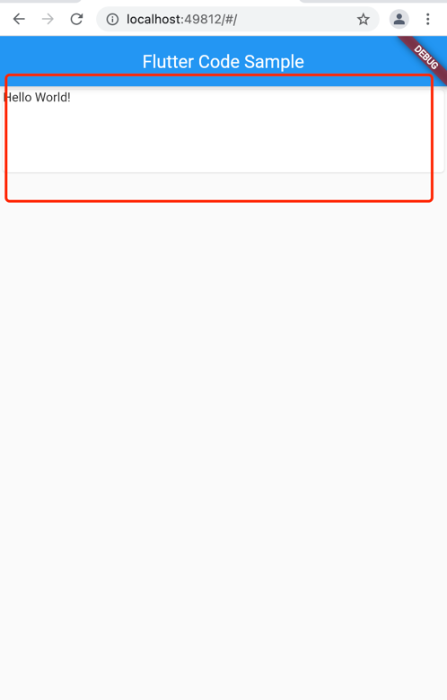
- Stack
    - Stack 类表示给定隔离的 Dart 堆栈跟踪的各种组件。
    - 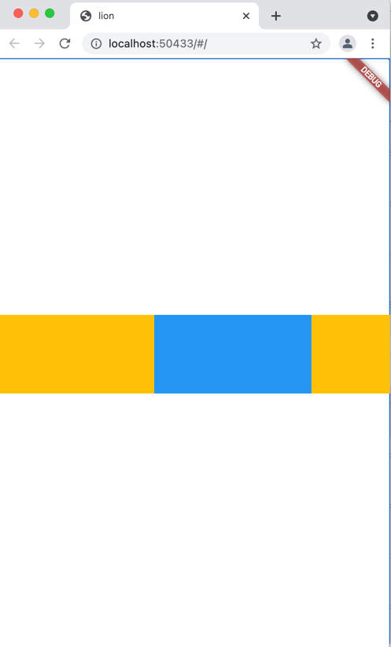

- AnimatedOpacity
    - Opacity 的动画版本，每当给定的不透明度发生变化时，它会在给定的持续时间内自动转换孩子的不透明度。
    - 

- FractionallySizedBox
    - 将其子级调整为总可用空间的一小部分的小部件。 如父空间的 widthFactor: 0.5, heightFactor: 0.5, 如下所示
    - 
- ListView
    - 线性排列的可滚动小部件列表。
      可以设置 scrollDirection: 
      Axis.horizontal 进行水平滚动
      reverse: true 由下往上滚动
      -
    
- Container

## Getting Started

This project is a starting point for a Flutter application.

A few resources to get you started if this is your first Flutter project:

- [Lab: Write your first Flutter app](https://flutter.dev/docs/get-started/codelab)
- [Cookbook: Useful Flutter samples](https://flutter.dev/docs/cookbook)

For help getting started with Flutter, view our
[online documentation](https://flutter.dev/docs), which offers tutorials, samples, guidance on mobile development, and a
full API reference.
